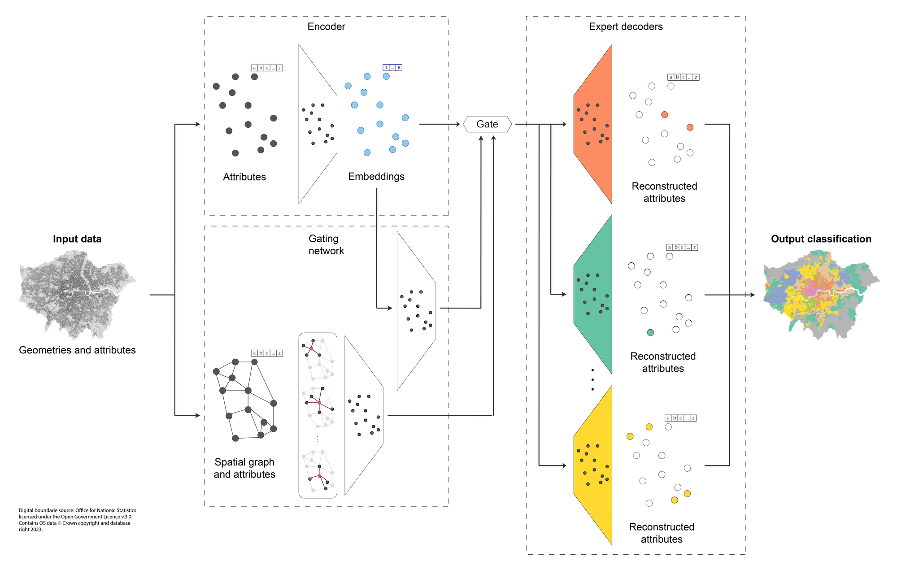

# AE-MoSE: an AutoEncoder Mixture of Spatial Experts for Geodemographic Classification

This repository includes the code that support the findings reported in the extended abstract *"AE-MoSE: an AutoEncoder Mixture of Spatial Experts for Geodemographic Classification"* (De Sabbata et al., 2026) presented at the [1st International Conference on Geospatial Artificial Intelligence (GeoAI 2026)](https://geoaiconference.org/), Ghent, Belgium on 3-6 June 2026.

```{bibtex}
todo
```

## Abstract

This work introduces a novel approach to geodemographic classification that combines an AutoEncoder architecture with a Mixture of Experts framework, incorporating a Graph Neural Network into the gating component to create a Mixture of Spatial Experts approach (AE-MoSE). We provide a description of the approach and illustrate some preliminary results.

## Architecture

AE-MoSE combines the autoencoder architecture with the mixture of experts framework for unsupervised classification. We propose a model defined as a combination of an encoder, a set of $P$ expert decoders and two components defining a two-level hierarchical gating structure. In general, any of the encoder, decoder and gating networks can be constructed as a simple Multi-Layer Perceptron (MLP) or a spatially-explicit neural network, using graph neural network layers or location encoding, thus varying the quantitative and qualitative attention that the overall model pays to the spatial aspects of the data.




## Results

The figure below illustrates the results obtained when applying the best-performing checkpoint (at epoch 1381) of the model described in the previous section to the entire dataset.The inset maps in the lower part of the image show the detail for Glasgow (A), Liverpool (B), London (C) and Leicester (D). Experts in Groups $4$ and $6$ capture the UK countryside, while experts in the other groups focus on the urban and suburban areas, and experts frequently show correspondence with classes in the 2021 OAC.

![Map of the UK illustrating the classification obtained when applying the best-epoch model checkpoint on the whole dataset. The inset maps in the lower part of the image show the detail for Glasgow (A), Liverpool (B), London (C) and Leicester (D). Digital boundaries source: Office for National Statistics, National Records of Scotland and Northern Ireland Statistics and Research Agency, licensed under the Open Government Licence v.3.0. Contains NRS, OSNI, andOS data. Crown copyright and database right 2023.
](images/aemose-4-4_e7x3_20260517124211__ep1381-st516868__classif.jpg)

## How to run

This repository is *not* currently configured for full end-to-end reproducibility, as the source data are not included. To reproduce this repository, download the [Unified UK Census Data (2021/2)](https://data.geods.ac.uk/dataset/unified-uk-census-data), available via the [Geographic Data Service](https://data.geods.ac.uk/). Prepare the data to train the model using the notebooks available in the `data/` folder, making sure to match the folder structure and filenames with the ones used in the code or vice versa. Note that the `data_prep_shuffle.ipynb` notebook is configured to select a random seed to shuffle the dataset rows, which will change from run to run. The model presented in the paper was trained with the dataset shuffled using the random seed `83566`. You can then train the model using the scripts in the `code/` folder and run the evaluation using the notebooks in the `eval/` folder.

## How to cite

```{bibtex}
todo
```

## Acknowledgments

This work was supported by the Economic and Social Research Council, Smart Data Research UK Fellowship, grant number UKRI4013.

## Licence

The code and output data in this repository are licensed under MIT License. The paper and images are licensed under the Creative Commons Attribution 4.0 License. The maps use digital boundaries from Office for National Statistics licensed under the Open Government Licence v.3.0, contains OS data Crown copyright and database right 2023.
